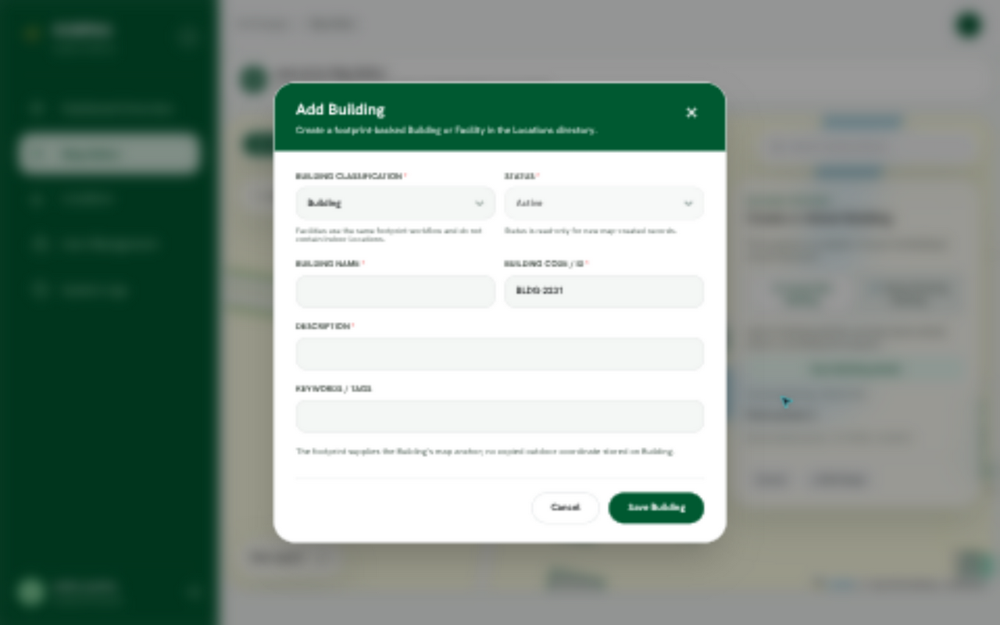
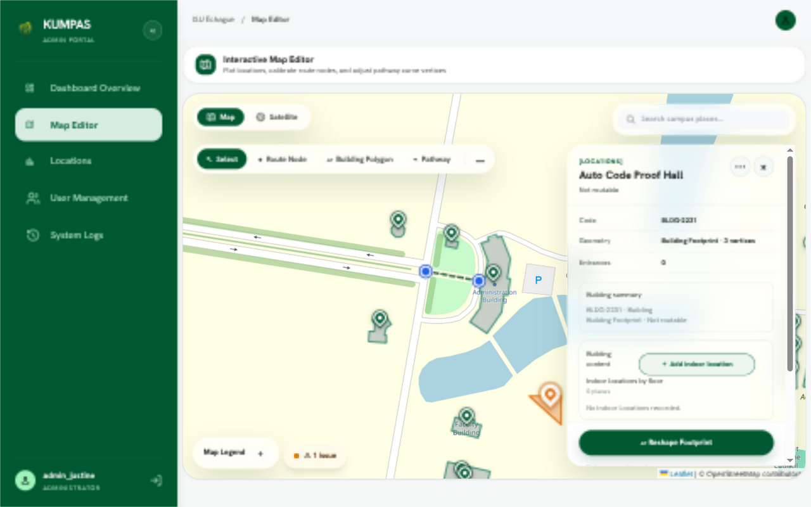

# Automatic building code proof

New map-created Buildings (and Facilities through the same form) receive an editable `BLDG-####` default, using the last four timestamp digits just like Locations. Draft resets generate a default again; reopening details retains manual edits. Existing identity, attach, reshape, and draft recovery paths retain their codes.

## Browser evidence

Captured on 2026-10-02 with the seeded local test adapter (`VITE_TEST_LOCAL_ADAPTER=true VITE_API_MODE=local VITE_MAP_FIXTURE=osm`), not a production backend.

Before implementation, completing a footprint opened Add Building with a blank code:

After implementation, a fresh footprint opened Add Building with `BLDG-2231` already filled:

Entering only a name and description saved the Building with that same code:

## Automated verification

Run from `frontend/admin`:

- Before: `npm test -- src/features/map/building/MapEditor.building.test.tsx -t 'manually|without requiring'` — both new regression cases failed on the empty code. [Output](red.log).
- After: `npm test` — **42 files, 371 tests passed**, including default-code creation, manual override preservation, and default reset after discarding a draft. [Output](tests.log).
- `npm run build` — TypeScript and Vite passed. Vite reported its bundle-size advisory. [Output](build.log).
- `git diff --check` — passed.

An independent code review found no actionable issues.

The timestamp format follows existing Locations behavior; duplicate-code validation still applies, so the four-digit default is not a uniqueness guarantee.
